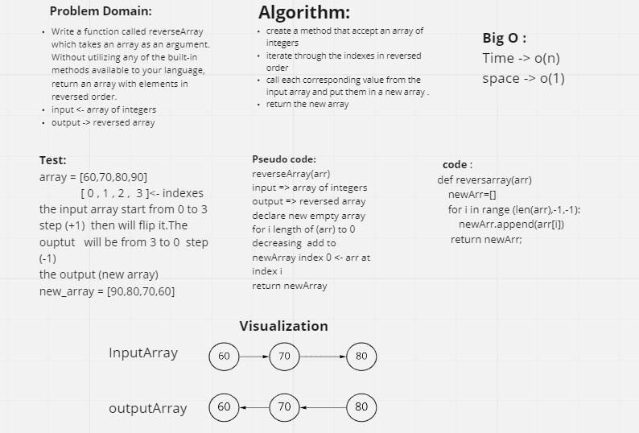

## Class 01 : Array Reverse

[Back to main](https://github.com/Raghdsmadi/data-structures-and-algorithms) 
*************************************

## Whiteboard 

## Approach & Efficiency

    I reversed the indexes of the array, then assigned the corresponding elements of the new indexes from the original array to a new empty array.

 

