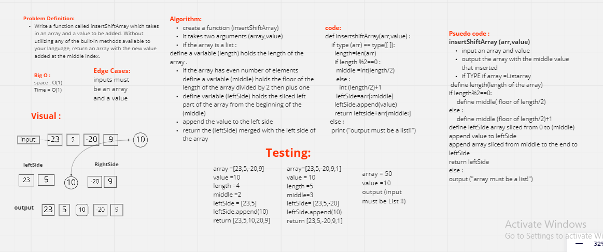

## Class 02 : insertShiftArray

[Back to main](https://github.com/Raghdsmadi/data-structures-and-algorithms) 
*************************************

## Whiteboard 



## Approach & Efficiency

```
 I sliced the array into two halves, then appended the desired value between them and returned the combined three parts.

    The space and time of the code were following the O(1), because code's capacity and execution time are fixed due to the absence of loops
```