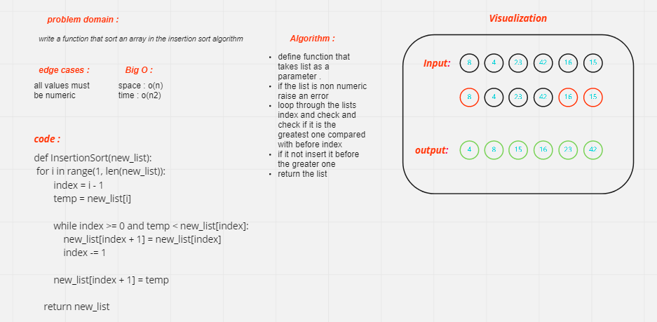

# Challenge insertion sort

> [Back](../../README.md)
> 
Write a function that sort the input array in the (Insertion Sort) algorithm

***************************

 
************************
## Approach & Efficiency

Big-O is o(n2) for time because we have 2 nested loops, and o(n) for space because we created a list 
